# A friendly user guide for map drawing in CoppeliaSim

> Author: Shelly Tang  2020/12/28

CoppeliaSim中的地图路径绘制分为如下几个步骤：

1. **添加路径**：[Menu -- > Add --> Path --> Segment type/Circle type]

   - Segment type：线段类型
   - Circle type：封闭图形类型

   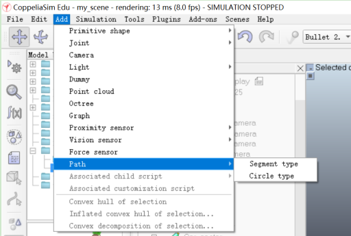

   

2. **编辑路径**：添加路径后，在地图中可以看到虚线的路径。选中路径，点击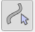进入编辑模式：

   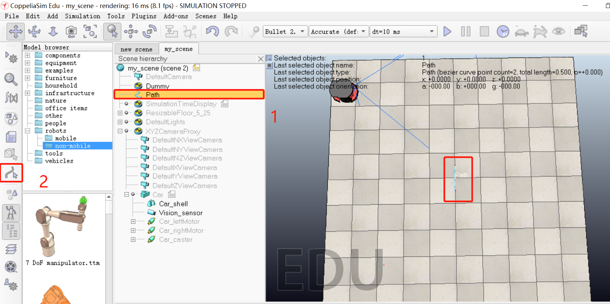

   选中需要调整的点，可发现其中一个点变成白色；选择“Object / item shift” 模式（左上角的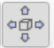），便可移动选中的白点到对应的位置。

   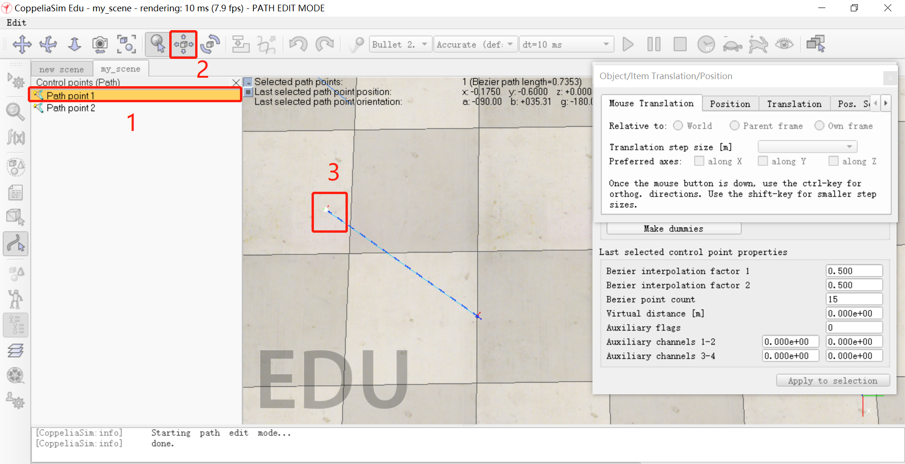

   若需要**添加点**，可单击右键，选择“Insert new control point after selection”。

   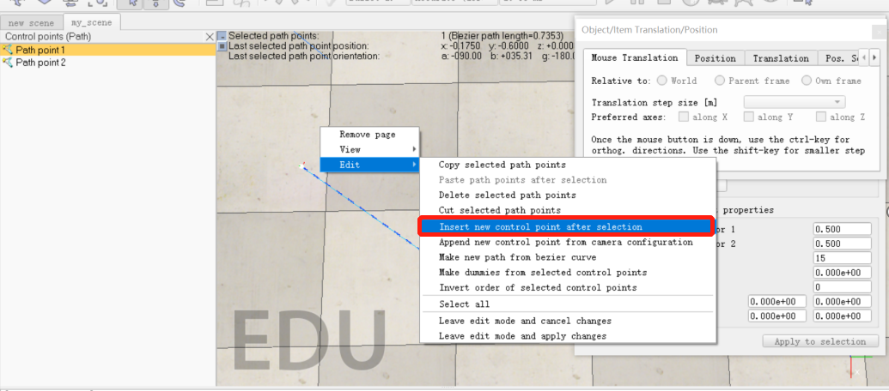

   此时，选择线上任意位置，可发现多出现了一个点，即下图中的"Path point 2"。

   若需要**调整曲率**，可修改下图右下角两个"Bezier interpolation factor"，数值可在$(0,1)$之间调整。数值越大，弧度越大（即弯越缓）；数值越小，弧度越小（弯越急）。

   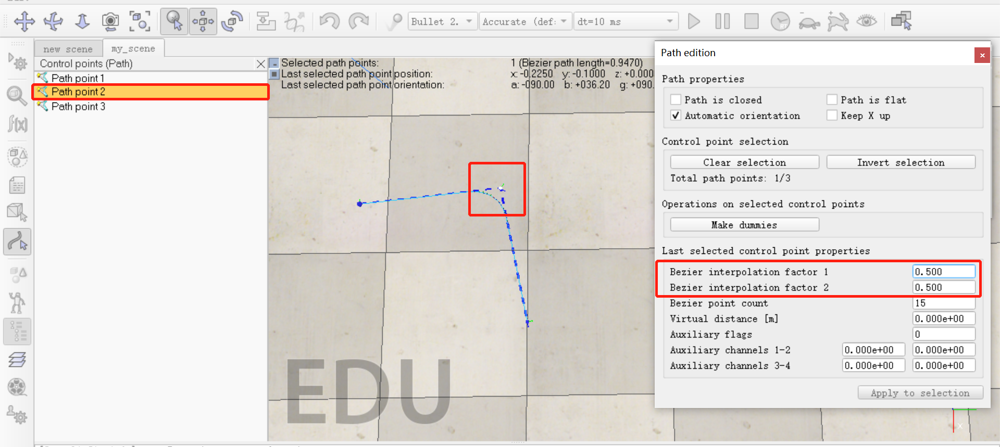

   调整完路径后，关闭小窗口，并按保存路径。此时发现路径的颜色很浅，且是虚线的。

   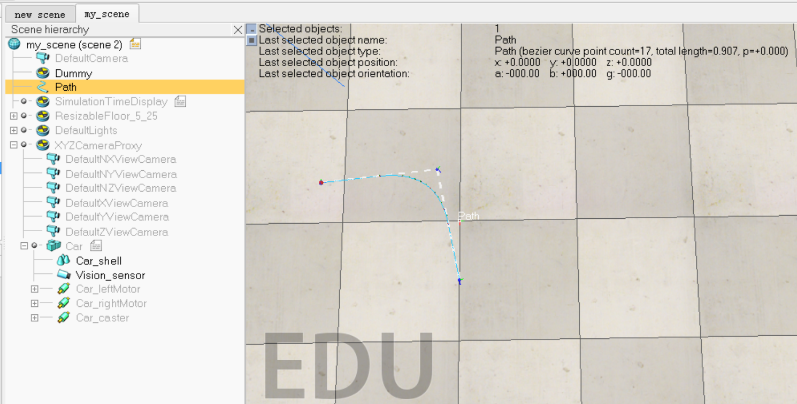

   

3. **修改路径属性**：选中路径 ，点击以修改路径属性；取消勾选"3"位置的三个show选项；点击"3"上面的"Show path shaping dialog" 进入到中间的小窗；勾选"4"位置的选项；将“5”位置的Type选项修改为"horizontal segment"；将 “6”位置的"Scaling factor"修改为$4$；点击"7"位置的"Adjust color"，进入到右下角的小窗；点击“8”位置的"Ambient/diffuse componnet"，进入到右上角的小窗；将”9“位置的RGB三个值修改为0，统一路径颜色为黑色。此时，得到路径效果如下：

   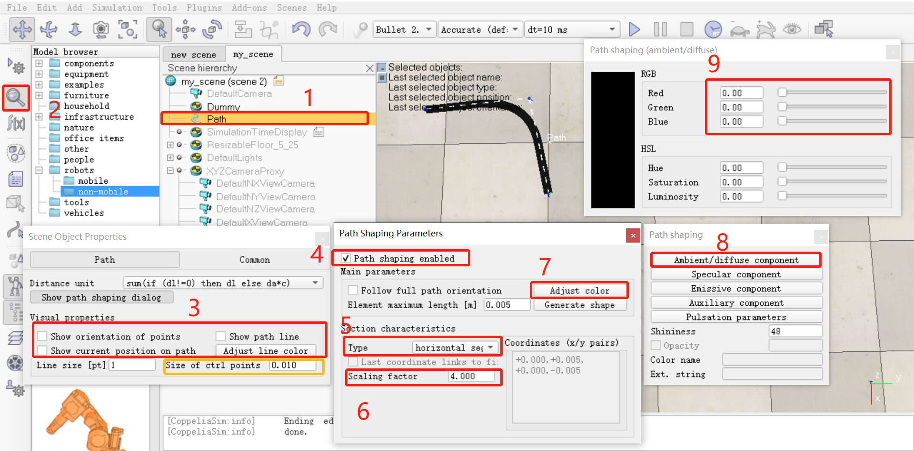

   **值得注意的是：**

   - 若需要修改路径的宽度，可以修改上图黄色框内的"Size of ctrl points"为0.010（默认值，但有时候会因Scaling而被修改为其他值，因此需要重新设定）；

     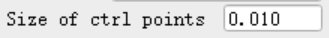

   - 并不是所有的Type都是“horizontal segment”，需要根据路径的显示情况进行修改。如画虚线的时候，会发现"vertical segment"的效果比"horizontal segment"的清晰（后者太浅了），因此需要将Type修改为"vertical segment"。

     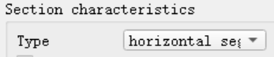

   - 在每次完成第二步“编辑路径”后，可能会发现路径并没有即时更新到图中。此时，需要再次进行第三步的操作，如将Type进行修改并恢复（如：从horizontal修改为vertical再恢复到horizontal segment），则可在图中看到最新编辑完的路径。

   - 当需要导出路径为`.ttm`文件时，需要将路径设置为model base（即Path左边出现小圆点）。此时，选中路径；点击进入修改路径属性；点击“3”位置的"Common"；勾选“4”位置的"Object is model base"选项，此时即可导出为model。

     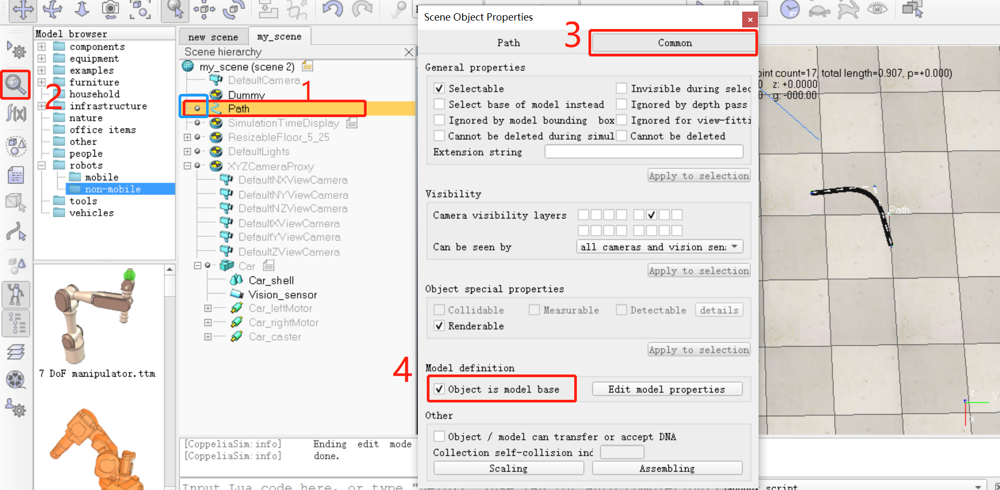

   - Path可分块组织（如下图），这样可方便修改整块的子路径：

     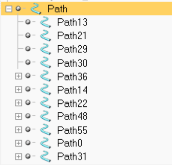
